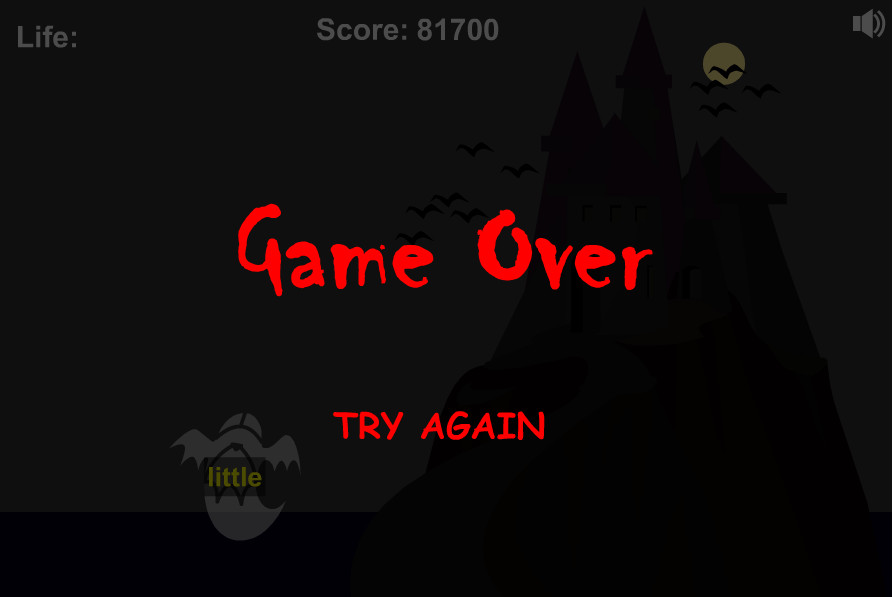

有一个打字游戏：ghosts.swf。这个游戏实在是太难了，我最多能够达到12000分。
我好想知道这个游戏的最高境界是什么，通关之后的界面是什么。  
不能乱按键盘，因为乱打会导致分数迅速下降到负数。

大体解决思路是：屏幕截图，分析图片，然后模拟按键。
屏幕截图用到PIL，按键用到PyUserInput，图像处理用到skimage，图像分类用到sklearn

## 最终战绩

需要考虑跨平台性，需要方便复制这个过程。
不能因为屏幕尺寸的变化影响字符识别。

## 目录说明   
### 文件夹部分 

* model:存放模型数据，如CNN训练结束后的模型
* grab：截图之后存储路径，这里面放的都是大图
* hand-label：对grab文件中的字符进行截图，手工标注，标注时对于粘连字符使用小括号括起来，如dictina(ry)，程序会自动读取hand-label中的数据并进行切割，保证切割出来的聚类个数等于所标注的答案的个数。如果hand-label中有两个相同的词，使用“xxx-2”和“xxx-3”加以区分。
* data：根据hand-label中的标注，生成的单字符图片文件。这个文件中的数据就是最终用于训练分类器的数据。
* tmp：用于存放临时数据，如切分之后的各个字符单元的图片
* unsolve：用于记录一些比较难以解决的问题，实际上可能已经解决了
* snippet：一些代码片段

### 文件部分 
* cnn.py：卷积神经网络用于字符识别
* ghosts.swf：flash，打字游戏
* haha.html：html网页，内嵌有ghosts.swf
* haha.log:打印出来的日志，用于分析系统瓶颈
* main.py:主程序，开启此程序之后，打开haha.html即可
* recognize.py：用于图像聚类、把截图解析为若干个字符矩形
* words.txt:包含2000常用单词
* 传统机器学习方法.py:包含决策树、最近邻、随机森林三种分类器
* 去掉非黄色像素.jpg：用于保存中间结果
* analyze.py：给定一张图片，列出这张图片上的每个字符，此程序用于调试。
* 抓取一次屏幕所需要的时间.py：用于测试抓取一次屏幕所需要的时间，直接读取图片远远快于屏幕抓取。但是没有必要，因为单线程是最优的，必须得要等到打完字之后再去截屏才可以，没等打完字就提前截屏，会导致相同的单词打了好多遍。
* 排序器.py：用于对各个字符矩形进行排序，用于确定先打哪个字，后打哪个字。
* 数据分析.py：用于分析data目录下的数据，用于查看每个字符图片的长度、高度。从而确定程序的一些参数。
* 灰度化之后.jpg：用于保存中间结果
* 生成数据.py：用于解析hand-label中手工标注的数据，将数据生成到data目录中去。
* 统计日志.py：用于解析haha.log，生成柱状图，查看各个函数的运行时间。
* 截图.py：用于进行截图操作

## how to run
如果不使用现在的hand-label中已经标注好的数据，那么首先就需要构建手工标注的数据集。

而构造hand-label就需要收集一些grab中的数据，可以运行main函数，打开浏览器，手工打字，多坚持一段时间，这样后台程序就在将截图保存到grab中。

打开截图工具，打开grab中的图片，觉得哪个单词好就用截图工具去截取图片，保存为单词名称。如果单词中有连字，如ry常常连着，就写作“dictiona(ry)”，如果hand-label中已经包含dictiona(ry).jpg了，那就写成dictiona(ry)-1.jpg，以此类推，使用减号加数字的方式保存多张图片。

运行程序“生成数据.py”解析hand-label中的数据生成data。这样就可以获取了数据。

除了CNN分类器运行时间较长，需要将训练过程得到的结果保存下来。其余分类器速度都很快，无需保存模型。

## 实现屏幕截图有三种方式
* windows API
* PIL的ImageGrab模块
* Selenium实现屏幕截图

经过实验，三种方式windows API方式速度最快，所以采用windows API的方式进行屏幕截图。

## 碎碎念
天下武功，唯快不破。这句话默认就是准确度是有的。  
准确度和速度二者有时可以互相弥补。准确度高了，避免了重复处理修改错误的过程。

模拟键盘和鼠标的跨平台Python库：PyUserInput
https://github.com/PyUserInput/PyUserInput

图像W*H，每一个像素都相当于一个神经元，神经元之间互相关联。每个神经元根据周围元素决定自己的变化。

有些情况下，会出现字符遮挡的情况，如果一个单词你打了一半，而此单词的另一半被另一个单词遮挡住了，那么你必死无疑。因为你看不见后面的字就无法完成这个单词，也就无法重新开始打新的单词，这种情况不仅机器解决不了，即便是人，也很难解决。所以需要对单词进行排序，优先打那些置信度较高的单词，也就是没有被遮挡的单词。

基于图像相似度的最近邻和传统的二范数最近邻大不相同，基于二范数的最近邻可以使用KD树进行加速，速度提升非常明显。而基于图片两两比较，效率很低（效果也很好）。

卷积神经网络对于数据分布要求比较严格，神经网络比较适合样本比较大的数据，样本太少，很容易让神经网络过拟合，因为神经网络就是国之重器，是高射炮。数据量太少，无法让神经网络充分理解数据。只有数据量多，神经网络才能从各个角度理解数据，才能不断地调整参数。

一般情况下，SVM、最近邻、决策树及其集成学习效果都是特别好的，甚至不比神经网络差。在特征提取较好的情况下尤为如此。随机森林、xgboost一定要好好研究一下。

凡事总是想着规整，效率就会降低，不如凌乱一些速度快。
编程不是从头到尾，编译运行就可以的，而是一边编、一边运行、一边修改的过程，例如，程序中的某个常数可能需要通过运行程序来调整才能达到最好效果。而且，只有看到运行效果之后，你才可能想到更好的解决方法。所以，编程是困难的，因为这个过程是用程序求程序的过程，是一个迭代的过程，需要步步为营，不断发现。
不要想着记录自己来时的路，只管自由自在地随便走吧。  
也就是说，不要考虑让别人重复自己的工作。  
也就是说，许多构建工具只能记录一点点自己的步骤，而其它的步骤只能通过自己去探索。  

为了解决字符覆盖问题，需要考虑单词的z序（也就是谁在前，谁在后），我采用了英语字典的方法，通过查询单词是否在2000个常用词列表中来判断这个单词的置信度。打字时优先打置信度高的字符。这样做又会带来其它问题，如果字符识别正确率比较低，可能一个单词需要打多次才能让它消失，如果打了一半，下次又去打置信度高的单词，那是无法打成的，因为只能打完一个单词再开始另外一个单词。  
在判断单词时，找到了一个python包，名叫pyenchant，这个包依赖于enchant库，而enchant库又不提供windows版的，导致pyenchant无法跨平台了。真是坑之极矣。还有linux下的工具，名叫aspell，也是乱得很。所以最终通过2000个常用单词列表组成一个哈希集用于判断单词是否存在。

一开始我想用语音输入的方式，我看到一个单词之后，立马喊出来，调用语音识别程序生成字符串。这种方式显然是不可行的，首先语音识别很慢（不论是调用API还是自己实现语音识别）；
其次，语音输入方式不可能比字符输入的方式快。当程序打到40000分时，字符出现消失的速度实在太快，根本来不及喊出来。

语音和视频是时序的，图片和文字是空序的，时序的东西不容易穿越，空序的东西容易穿越。时序的东西不容易并行，空序的东西容易并行。  
RNN是时序的，CNN是空序的，CNN速度明显快于RNN。

要想达到高的分数，需要有好的运气。

将html中的swf的尺寸设置成固定的，这样才能够保证跨平台，因为hand-label是在固定尺寸下截取的图像。让swf的尺寸比较小，就可以加快处理速度。
如果图像太小，会导致噪声的比例变大，识别上也会带来很大影响。

不能使用多进程进行截图，只能等待打完字之后休息一会儿才可以继续截图，否则会打印大量的重复字符，造成分数下降。

长相上有一句话叫做“一白遮千丑”，算法上有一句话叫“一快遮千丑”。  
天下武功，唯快不破。  
如果硬件慢，可能就会想许多繁琐而复杂的优化；而一个好的硬件足以弥补算法的不足。  
实际中的问题，虽然是NP问题，却也可能通过强大的算力进行解决。  
要有一种思想：设计硬件、加速计算的思想。  
不要让贫穷限制自己的想象力。  
比如alphazero，拥有好的硬件就拥有了简洁优美的算法。

对于单词重叠的情况，前面的单词仿佛在掩护后面的单词，
前面的单词刚刚打完，后面的单词已经炸了，这就像打仗时的火力掩护。要想突破这个问题，最简单的方式就是“快”。
而要想快，通过查找系统瓶颈，才能找到优化对象。

一个系统有多个入口是指一个系统有多个main函数，执行哪一个都可以，并且编译不会报错。这是
一件非常好的事情，非常便于开发。可是C++却不支持这种方式。一个系统有多个入口，看上去这
个系统像一个多面体一样，从不同的面看上去有不同的现象。
